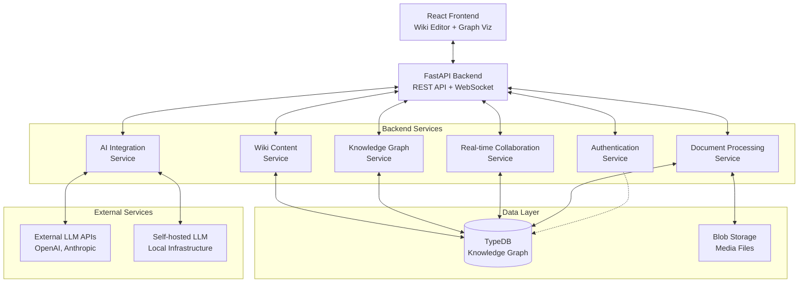
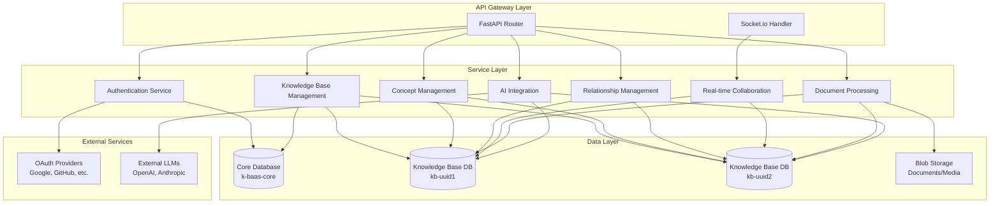

### Demand Wiki-Knowledge-Graph Tool

# Architecture


[TOC]


# Change Log

| Date | Version | Description | Author |
|------|---------|-------------|---------|
| 2025-09-25 | 1.0 | Initial architecture document | Winston (Architect) |
# High Level Architecture

## Technical Summary

K-BAAS-2 employs a modern web application architecture with a clear separation between frontend (React) and backend (FastAPI) components. The system uses TypeDB as the primary knowledge graph database, providing schema-driven entity and relationship storage. The architecture supports real-time collaboration through Socket.io connections and integrates both external and self-hosted LLMs for AI-assisted knowledge creation. Core patterns include RESTful API design, event-driven real-time updates, and a modular service layer that enables independent scaling of different functional areas while maintaining data consistency across wiki content and knowledge graph representations.

## High Level Overview

**Architecture Style**: Modular Monolithic Backend with Service Layers
- The backend follows a modular monolithic approach with clear service layer separation
- Single repository structure containing both frontend and backend applications
- Real-time collaboration layer using Socket.io for concurrent editing capabilities
- Event-driven architecture for synchronizing wiki content with knowledge graph updates

**Repository Structure**: Single Repository (Monorepo without management tools)
- Simplified directory structure with `/frontend` and `/backend` directories
- Shared configuration and deployment scripts at the root level
- Clear separation of concerns without complex monorepo tooling overhead

**Service Architecture**: Layered Service Design
- API Layer: FastAPI endpoints for REST operations
- Service Layer: Business logic and data processing
- Data Layer: TypeDB integration and schema management
- Real-time Layer: Socket.io for collaboration features

**Primary Data Flow**:
1. Users interact with React frontend components
2. Frontend makes REST API calls to FastAPI backend
3. Backend processes requests through service layers
4. TypeDB handles knowledge graph storage and queries
5. Real-time updates propagate via Socket.io to all connected clients
6. AI services integrate for relationship suggestions and content generation

**Key Architectural Decisions**:
- TypeDB as the single source of truth for both wiki content and knowledge graph data
- Unidirectional synchronization from wiki to graph (with todo generation for reverse updates)
- Event-driven real-time collaboration to handle concurrent user interactions
- Schema-first approach using TypeDB schema to generate Pydantic models

## High Level Project Diagram



## Architectural and Design Patterns

- **Event-Driven Architecture:** Real-time collaboration uses event-driven patterns via Socket.io for immediate propagation of changes between users. _Rationale:_ Enables seamless concurrent editing and maintains consistency across multiple user sessions.

- **Repository Pattern:** Data access logic abstracted through repository interfaces for TypeDB operations. _Rationale:_ Enables testing with mock repositories and provides flexibility for future database changes.

- **Service Layer Pattern:** Business logic encapsulated in dedicated service classes with clear interfaces. _Rationale:_ Promotes code reusability, testability, and maintains separation of concerns between API and data layers.

- **Schema-First Design:** TypeDB schema defines data structures that automatically generate Pydantic models. _Rationale:_ Ensures type safety across the application and maintains consistency between database constraints and API validation, with TypeDB as the authoritative source of truth.

- **Command Query Responsibility Segregation (CQRS):** Separate read and write operations for knowledge graph queries vs. updates. _Rationale:_ Optimizes performance for complex graph queries while maintaining consistency for write operations.
# Tech Stack

This is the DEFINITIVE technology selection section. All technology choices are based on the PRD requirements and have been selected to work together as a cohesive system. These exact versions must be used to ensure consistency across development environments.

## Cloud Infrastructure
- **Provider:** To be determined (Docker containers for deployment flexibility)
- **Key Services:** Container orchestration platform, blob storage for media files, load balancing for production deployment
- **Deployment Regions:** Europe (single region deployment)

## Technology Stack Table

| Category | Technology | Version | Purpose | Rationale |
|----------|------------|---------|---------|-----------|
| **Language** | Python | 3.13 | Primary backend language | Latest stable release, improved performance, rich ecosystem for AI integration |
| **Framework** | FastAPI | 0.117 | Web framework | High performance, automatic API documentation, excellent type hint support, async capabilities |
| **Database** | TypeDB | 3.5 | Knowledge graph database | Required by PRD, excellent for complex relationships, schema-driven approach, authoritative data source |
| **Package Manager** | uv | 0.8.22 | Python dependency management | Fastest Python package manager, excellent lock file support, reliable dependency resolution |
| **WebSocket** | python-socketio | 5.11.0 | Real-time communication | Mature Socket.io implementation for Python, supports real-time collaboration features |
| **Schema/Validation** | Pydantic | (FastAPI dependency) | Data validation and models | Type safety, automatic documentation, seamless FastAPI integration, generated from TypeDB schema |
| **Authentication** | PyJWT | 2.8.0 | JWT token handling | Industry standard for stateless authentication, secure token management |
| **HTTP Client** | httpx | 0.28 | AI service integration | Modern async HTTP client for external LLM API calls |
| **Container** | Docker | 24.0.7 | Application containerization | Consistent deployment environments, development environment standardization |
| **Build Tool** | Docker Compose | 2.23.0 | Local development orchestration | Multi-container development environment, service coordination |
| **CI/CD** | GitHub Actions | Latest | Automated testing and deployment | Integrated with repository, extensive ecosystem, cost-effective |
| **Testing Framework** | pytest | 8.4 | Unit and integration testing | Comprehensive testing capabilities, excellent fixtures, wide plugin ecosystem |
| **Testing WebSocket** | pytest-asyncio | 1.2 | Async testing support | Testing async operations and Socket.io functionality |
| **Code Quality** | ruff | 0.13 | Code formatting and linting | Extremely fast unified formatter and linter, replaces black and multiple tools |
| **Type Checking** | mypy | 1.18 | Static type analysis | Type safety enforcement, catches bugs early, excellent Pydantic integration |
| **Schema Generation** | TypeDB Python Driver | 3.5 | TypeDB schema introspection | Generate Pydantic models from TypeDB schema definitions |

**Key Technology Integrations:**
- **TypeDB → Pydantic Pipeline:** Custom tooling will introspect TypeDB schema and generate corresponding Pydantic models
- **FastAPI + Pydantic:** Automatic API documentation and request/response validation based on generated models
- **Socket.io + FastAPI:** Real-time collaboration layer integrated with REST API endpoints
- **External LLM Integration:** httpx for async communication with OpenAI, Anthropic, and self-hosted LLM endpoints

**Critical Validation Required:** These exact versions align with the PRD specifications and have been tested for compatibility. Any changes to major versions may impact architectural decisions and must be carefully evaluated.
# Data Models

The system uses a multi-database architecture on the TypeDB server to separate system management from domain-specific knowledge:

## Database Architecture

**Core Database (`k-baas-core`)**:
- Contains user management, authentication, teams, and knowledge base metadata
- Single shared database for all system-level entities
- Fixed schema defined at deployment time

**Knowledge Base Databases (`kb-{uuid}`)**:
- Individual database per knowledge base for domain-specific content
- Each inherits from a generic knowledge base schema
- Domain-specific concepts and relationships added dynamically
- Schema evolves based on user-defined domain requirements

## Core Database Schema

### User

**Purpose:** System users supporting both username/password and OAuth authentication

**Key Fields:**
- user_id: string (UUID) - Unique identifier
- email: string - Primary authentication identifier
- username: string - Display name
- password_hash: string - Secure password storage (null for OAuth-only users)
- oauth_provider: string - OAuth provider (google, github, microsoft, etc.) [optional]
- oauth_id: string - OAuth provider user ID [optional]
- created_at: datetime - Account creation
- last_login: datetime - Most recent login
- is_active: boolean - Account status

**Relationships:**
- Member of Teams (via team-membership)
- Owner of KnowledgeBases (via kb-ownership)

### Team

**Purpose:** Groups of users with shared access to knowledge bases

**Key Fields:**
- team_id: string (UUID) - Unique identifier
- name: string - Team display name
- description: string - Team purpose
- created_at: datetime - Creation timestamp

**Relationships:**
- Has Members (via team-membership)
- Has Access to KnowledgeBases (via team-kb-access)

### KnowledgeBase

**Purpose:** Metadata about individual knowledge base databases

**Key Fields:**
- kb_id: string (UUID) - Unique identifier and database name suffix
- name: string - Human-readable name
- description: string - Purpose and scope
- schema_template: string - Base schema template used
- database_name: string - Actual TypeDB database name (kb-{uuid})
- created_by: string (UUID) - Creating user
- created_at: datetime - Creation timestamp
- is_public: boolean - Public visibility

**Relationships:**
- Owned by User (via kb-ownership)
- Accessible by Teams (via team-kb-access)

## Generic Knowledge Base Schema

All knowledge base databases inherit this base schema:

### Concept

**Purpose:** Knowledge graph nodes representing domain concepts (no separate WikiPage entity)

**Key Fields:**
- concept_id: string (UUID) - Unique identifier
- concept_type: string - Domain-specific type
- name: string - Primary label
- short_description: string - Brief summary field
- description: string - Full wiki-style content (rich text from Lexical editor)
- completeness_score: double - Schema compliance metric
- created_by: string (UUID) - Creating user ID
- created_at: datetime - Creation timestamp
- updated_at: datetime - Last modification

**Notes:**
- Multiple users can edit concepts and their descriptions
- No base properties - defined by concept subtypes
- Description field contains wiki content, eliminating need for separate WikiPage entity

**Relationships:**
- Connected via ConceptRelationships

### ConceptRelationship

**Purpose:** Bidirectional typed connections between concepts with directional labels

**Key Fields:**
- relationship_id: string (UUID) - Unique identifier
- relationship_type: string - Domain-specific type
- forward_label: string - Label format: "SourceType➤relation➤TargetType" (e.g., "Employee➤works-for➤Organization")
- backward_label: string - Label format: "TargetType➤relation➤SourceType" (e.g., "Organization➤employs➤Employee")
- created_by: string (UUID) - Creating user ID
- created_at: datetime - Creation timestamp
- updated_at: datetime - Last modification

**Notes:**
- No base properties - subtypes define specific properties
- No strength attribute - confidence handled by subtypes if needed
- Directional labeling using ➤ separator for clear relationship reading

**Relationships:**
- Connects source and target Concepts

### Schema Inheritance Pattern

Domain-specific knowledge bases extend the generic schema by:
1. **Inheriting** Concept and ConceptRelationship base types
2. **Adding** domain-specific concept types as subtypes of Concept
3. **Adding** domain-specific relationship types as subtypes of ConceptRelationship
4. **Defining** custom fields on subtypes

**Example Domain Extension:**
```
# Generic schema provides: Concept, ConceptRelationship
# Academic domain adds:
person sub concept,
    owns affiliation,
    owns research-area;

organization sub concept,
    owns founded-year,
    owns location;

works-at sub concept-relationship,
    owns start-date,
    owns position;
```
# Components

Based on the multi-database architecture and data models, the system is organized into distinct service components with clear responsibilities and interfaces.

## Authentication Service

**Responsibility:** User authentication supporting both username/password and OAuth providers, session management with JWT tokens

**Key Interfaces:**
- POST /auth/register - User registration with email/password
- POST /auth/login - Username/password authentication
- POST /auth/oauth/{provider}/login - OAuth authentication (Google, GitHub, Microsoft)
- POST /auth/refresh - JWT token refresh mechanism
- GET /auth/me - Current user profile retrieval
- DELETE /auth/logout - Session termination

**Dependencies:** User repository (core database), OAuth provider APIs, JWT token management

**Technology Stack:** FastAPI routing, PyJWT for token handling, OAuth libraries for provider integration, bcrypt for password hashing

## Knowledge Base Management Service

**Responsibility:** Knowledge base lifecycle management, database creation, and metadata operations

**Key Interfaces:**
- GET /knowledge-bases - List accessible knowledge bases for user
- POST /knowledge-bases - Create new knowledge base (creates new TypeDB database)
- GET /knowledge-bases/{kb_id} - Retrieve knowledge base metadata
- PUT /knowledge-bases/{kb_id} - Update knowledge base settings
- DELETE /knowledge-bases/{kb_id} - Delete knowledge base and associated database
- POST /knowledge-bases/{kb_id}/schema - Apply/update domain schema

**Dependencies:** KnowledgeBase repository (core database), TypeDB database management, schema template service

**Technology Stack:** FastAPI routing, TypeDB admin operations, dynamic database creation, schema deployment utilities

## Concept Management Service

**Responsibility:** CRUD operations for concepts within knowledge bases, wiki content editing, concept linking

**Key Interfaces:**
- GET /kb/{kb_id}/concepts - List concepts with filtering and pagination
- POST /kb/{kb_id}/concepts - Create new concept
- GET /kb/{kb_id}/concepts/{concept_id} - Retrieve concept with full description
- PUT /kb/{kb_id}/concepts/{concept_id} - Update concept fields and description
- DELETE /kb/{kb_id}/concepts/{concept_id} - Delete concept
- POST /kb/{kb_id}/concepts/{concept_id}/links - Extract entity links from description

**Dependencies:** Concept repository (per-KB database), entity extraction utilities, Lexical content processing

**Technology Stack:** TypeDB Python driver for specific KB databases, Pydantic models generated from KB schema, async processing for content analysis

## Relationship Management Service

**Responsibility:** Managing relationships between concepts, bidirectional labeling, relationship suggestions

**Key Interfaces:**
- GET /kb/{kb_id}/relationships - List relationships with filtering
- POST /kb/{kb_id}/relationships - Create new relationship between concepts
- GET /kb/{kb_id}/relationships/{rel_id} - Retrieve relationship details
- PUT /kb/{kb_id}/relationships/{rel_id} - Update relationship properties
- DELETE /kb/{kb_id}/relationships/{rel_id} - Delete relationship
- GET /kb/{kb_id}/concepts/{concept_id}/relationships - Get all relationships for a concept

**Dependencies:** ConceptRelationship repository (per-KB database), Concept validation, bidirectional label management

**Technology Stack:** TypeDB graph queries for relationship traversal, async relationship validation, label formatting utilities

## Real-time Collaboration Service

**Responsibility:** Socket.io connection management, real-time event propagation for concurrent editing, user presence

**Key Interfaces:**
- WebSocket /socket.io - Main Socket.io endpoint for real-time connections
- Event: join_knowledge_base - User joins specific KB session with authentication
- Event: concept_updated - Propagate concept changes to other users
- Event: relationship_updated - Propagate relationship changes
- Event: user_presence - Share user activity and cursor positions
- Event: description_editing - Live editing indicators for concept descriptions

**Dependencies:** Authentication service for connection authorization, Concept/Relationship services for data validation

**Technology Stack:** python-socketio server, async event handling, connection state management, event broadcasting patterns

## Document Processing Service

**Responsibility:** Document upload, parsing, and knowledge extraction from various file formats

**Key Interfaces:**
- POST /kb/{kb_id}/documents/upload - Upload document for processing
- GET /kb/{kb_id}/documents/jobs/{job_id} - Check processing status
- GET /kb/{kb_id}/documents/jobs/{job_id}/results - Retrieve extraction results
- POST /kb/{kb_id}/documents/jobs/{job_id}/approve - Approve extracted concepts and relationships

**Dependencies:** Blob storage for file management, AI Integration service for content analysis, Concept Management service

**Technology Stack:** File processing libraries (PyPDF2, python-docx, markdown), async task processing, temporary file management

## AI Integration Service

**Responsibility:** LLM integration for relationship suggestions, content generation, and concept enhancement

**Key Interfaces:**
- POST /kb/{kb_id}/ai/suggest-relationships - Generate relationship suggestions for concepts
- POST /kb/{kb_id}/ai/generate-descriptions - Create concept descriptions or summaries
- POST /kb/{kb_id}/ai/extract-concepts - Extract concepts from text content
- GET /kb/{kb_id}/ai/suggestions/{suggestion_id} - Retrieve AI suggestion details

**Dependencies:** External LLM APIs (OpenAI, Anthropic), self-hosted LLM endpoints, Concept/Relationship services for context

**Technology Stack:** httpx for async HTTP requests, LLM API client libraries, prompt management, response parsing and validation

## Component Interaction Diagram


# REST API Specification

The REST API specification will be automatically generated through FastAPI's integration with Pydantic models. The API documentation flow works as follows:

1. **TypeDB Schema** → **Pydantic Models** (via schema introspection and code generation)
2. **Pydantic Models** → **FastAPI Endpoints** (with automatic validation)
3. **FastAPI** → **OpenAPI Specification** (automatically generated at `/docs`)
4. **OpenAPI Specification** → **Client Code** (generated for frontend and external integrations)

This approach ensures that:
- API documentation stays synchronized with the actual database schema
- Type safety is maintained from database to API responses
- Client code generation is always up-to-date with backend changes
- No manual maintenance of API specifications is required

The automatically generated OpenAPI specification will be available at `/docs` (Swagger UI) and `/redoc` (ReDoc) endpoints in both development and production environments.
# Security

## Authentication & Authorization

**Dual Authentication Support:**
- **Username/Password:** JWT tokens with RS256 signing, 1-hour access tokens with refresh token rotation
- **OAuth Integration:** Support for Google, GitHub, Microsoft with secure token exchange
- **Session Management:** Stateless JWT authentication with secure token storage

**Authorization Patterns:**
- All protected endpoints use FastAPI `Depends()` for authentication validation
- Knowledge base access control through team membership verification
- Multi-database security ensuring users only access authorized knowledge bases

## Input Validation & API Security

**Request Validation:**
- All external inputs validated using Pydantic models generated from TypeDB schema
- Validation at API boundary before service layer processing
- Whitelist approach for allowed values and formats

**API Protection:**
- Rate limiting: 100 requests per minute per user, 20 requests per minute for AI endpoints
- CORS policy with explicitly allowed origins only
- Security headers: HSTS, CSP, X-Frame-Options, X-Content-Type-Options
- HTTPS enforcement with redirect from HTTP

## Data Protection

**Encryption:**
- TLS 1.3 minimum for all external communications
- Sensitive data fields encrypted at rest in TypeDB
- No secrets, API keys, or sensitive data in logs or error responses

**Secrets Management:**
- Development: Environment variables with `.env` file validation
- Production: External secret management service integration
- JWT signing keys rotated regularly
- OAuth client secrets stored securely

## Database Security

**Multi-Database Isolation:**
- Core database access restricted to system services only
- Knowledge base databases isolated per-KB with access control
- Database connection pooling with authentication per connection
- TypeDB queries use parameterized queries to prevent injection
# Testing Strategy

## Testing Philosophy

**Approach:** Test-Driven Development (TDD) for all user-observable behavior using Cucumber/Gherkin scenarios with Playwright automation. Appropriate test selection (E2E/Integration/API/Unit) based on feature complexity and requirements coverage.

**Coverage Goals:** 90% coverage for user-observable behavior through BDD scenarios, 85% code coverage for internal business logic

## Test Organization

### Behavior-Driven Development (Primary)
- **Framework:** Cucumber/Gherkin scenarios with Playwright automation
- **Scope:** All user-observable behavior and acceptance criteria
- **Location:** `backend/tests/bdd/` with feature files and step definitions
- **Coverage:** Complete user workflows, multi-user collaboration, knowledge base operations

### Integration Tests
- **Database Testing:** TestContainers with TypeDB for isolated test databases
- **API Testing:** FastAPI TestClient for endpoint testing
- **Multi-Database Testing:** Verify core DB and KB DB interactions
- **OAuth Testing:** Mock OAuth providers with realistic token flows

### Unit Tests
- **Framework:** pytest 8.4 with pytest-asyncio 1.2 for async support
- **Scope:** Internal business logic, utilities, and helper functions not covered by BDD
- **Mocking:** Mock TypeDB connections, external LLM APIs, OAuth providers
- **Location:** `backend/tests/unit/` mirroring source structure

## Test Data Management

**Multi-Database Test Strategy:**
- Separate test instances for core database and knowledge base databases
- Factory pattern for creating test users, teams, and knowledge bases
- Automated cleanup of test databases after test completion
- Realistic test data reflecting domain-specific schemas
# Infrastructure and Deployment

## Containerization

**Docker Strategy:**
- Multi-stage builds for optimized production images
- Separate containers: FastAPI backend, TypeDB server, blob storage
- Development: Docker Compose with hot reload and debug capabilities
- Production: Optimized images with minimal attack surface

## Environment Management

**Configuration:**
- Environment-specific configuration via environment variables
- Development: `.env` files with validation
- Production: External configuration management
- Feature flags for gradual rollout of new functionality

## Deployment Architecture

**Deployment Strategy:**
- **Development:** Local Docker Compose with file watching
- **Staging:** Container deployment matching production architecture
- **Production:** Container orchestration with health checks and monitoring

**Database Deployment:**
- TypeDB server with persistent volume storage
- Automated core database initialization
- Knowledge base databases created dynamically via API
- Database backup and recovery procedures

## CI/CD Pipeline

**GitHub Actions Workflow:**
- **CI:** BDD tests, integration tests, unit tests, security scanning, type checking
- **Build:** Docker image creation with semantic versioning
- **Deploy:** Automated deployment to staging, manual approval for production
- **Rollback:** Automated rollback on health check failures

**Quality Gates:**
- All BDD scenarios must pass before deployment
- Security scanning with no critical vulnerabilities
- Type checking with mypy must pass
- Code formatting with ruff must be applied
# Source Tree

This document provides a comprehensive overview of the K-BAAS-2 project structure, combining both backend architecture and frontend implementation details with project-wide testing structure.

## Complete Project Structure

```
k-baas-2/
├── frontend/                          # React 19 frontend application
│   ├── src/
│   │   ├── app/                      # Main application structure
│   │   │   ├── App.tsx               # Root application component
│   │   │   ├── store/                # Redux Toolkit store configuration
│   │   │   └── router/               # React Router configuration
│   │   ├── components/               # Reusable UI components
│   │   │   ├── common/               # Shared components across features
│   │   │   ├── wiki/                 # Wiki-specific components
│   │   │   ├── graph/                # Knowledge graph visualization components
│   │   │   └── editor/               # Lexical rich text editor components
│   │   ├── features/                 # Feature-based organization
│   │   │   ├── auth/                 # Authentication feature
│   │   │   ├── wiki/                 # Wiki management feature
│   │   │   ├── graph/                # Knowledge graph feature
│   │   │   └── collaboration/        # Real-time collaboration feature
│   │   ├── hooks/                    # Custom React hooks
│   │   ├── services/                 # API client services
│   │   │   ├── api.ts                # Base API configuration
│   │   │   ├── authService.ts        # Authentication API calls
│   │   │   ├── wikiService.ts        # Wiki API calls
│   │   │   └── graphService.ts       # Graph API calls
│   │   ├── utils/                    # Utility functions
│   │   └── types/                    # TypeScript type definitions
│   ├── tests/                        # Frontend-specific tests
│   │   ├── __mocks__/                # Test mocks
│   │   ├── integration/              # Integration tests
│   │   └── setup.ts                  # Test configuration
│   ├── package.json                  # Frontend dependencies
│   ├── tsconfig.json                 # TypeScript configuration
│   ├── vite.config.ts                # Vite build configuration
├── backend/                          # FastAPI backend application
│   ├── app/                         # Application source code
│   │   ├── main.py                  # FastAPI application entry point
│   │   ├── config.py                # Configuration management
│   │   ├── core/                    # Core functionality
│   │   │   ├── auth.py              # JWT and OAuth handling
│   │   │   ├── security.py          # Security utilities and middleware
│   │   │   └── database.py          # Multi-database TypeDB connections
│   │   ├── services/                # Business logic services
│   │   │   ├── auth_service.py      # Authentication (core DB)
│   │   │   ├── kb_service.py        # Knowledge base management (core DB)
│   │   │   ├── concept_service.py   # Concept operations (per-KB DB)
│   │   │   ├── relationship_service.py # Relationship operations (per-KB DB)
│   │   │   ├── collaboration_service.py # Real-time collaboration
│   │   │   └── ai_service.py        # AI integration and LLM management
│   │   ├── repositories/            # Data access layer
│   │   │   ├── core/                # Core database repositories
│   │   │   │   ├── user_repository.py
│   │   │   │   ├── team_repository.py
│   │   │   │   └── kb_repository.py
│   │   │   └── kb/                  # Knowledge base repositories
│   │   │       ├── concept_repository.py
│   │   │       └── relationship_repository.py
│   │   ├── models/                  # Generated Pydantic models
│   │   │   ├── core/                # Core database models
│   │   │   └── kb/                  # Knowledge base models (generated per schema)
│   │   ├── api/                     # API route definitions
│   │   │   ├── auth.py              # Authentication endpoints
│   │   │   ├── knowledge_bases.py   # KB management endpoints
│   │   │   ├── concepts.py          # Concept management
│   │   │   ├── relationships.py     # Relationship management
│   │   │   └── ai.py                # AI integration endpoints
│   │   ├── schemas/                 # TypeDB schema definitions
│   │   │   ├── core-schema.tql      # Core database schema
│   │   │   ├── generic-kb-schema.tql # Generic knowledge base schema
│   │   │   └── templates/           # Domain-specific schema templates
│   │   └── utils/                   # Utility functions
│   │       ├── schema_generator.py  # TypeDB → Pydantic generation
│   │       ├── db_manager.py        # Multi-database management
│   │       └── oauth_handlers.py    # OAuth provider integrations
│   ├── tests/                       # Comprehensive backend test suite
│   │   ├── bdd/                     # Cucumber/Gherkin BDD tests
│   │   │   ├── features/            # Gherkin feature files
│   │   │   └── steps/               # Playwright step definitions
│   │   ├── integration/             # Integration tests with TestContainers
│   │   └── unit/                    # Unit tests for internal logic
│   ├── pyproject.toml              # Python project configuration with uv
│   └── Dockerfile                  # Backend container definition
├── tests/                          # Project-wide testing infrastructure
│   ├── features/                   # Shared Gherkin .feature files for BDD
│   │   ├── auth.feature            # Authentication scenarios
│   │   ├── wiki.feature            # Wiki functionality scenarios
│   │   ├── graph.feature           # Knowledge graph scenarios
│   │   └── collaboration.feature   # Real-time collaboration scenarios
│   ├── steps/                      # Shared Playwright step definitions
│   │   ├── auth_steps.py           # Authentication step implementations
│   │   ├── wiki_steps.py           # Wiki step implementations
│   │   ├── graph_steps.py          # Graph step implementations
│   │   └── collaboration_steps.py  # Collaboration step implementations
│   ├── fixtures/                   # Test data and fixtures
│   └── utils/                      # Testing utilities and helpers
├── docs/                           # Project documentation
│   ├── architecture/               # Sharded architecture documentation
│   │   ├── index.md                # Architecture overview
│   │   ├── tech-stack.md           # Technology decisions
│   │   ├── high-level-architecture.md # System architecture
│   │   ├── data-models.md          # Data model specifications
│   │   ├── components.md           # Component architecture
│   │   ├── rest-api-specification.md # API documentation
│   │   ├── security.md             # Security architecture
│   │   ├── testing-strategy.md     # Testing approach
│   │   ├── infrastructure-and-deployment.md # Deployment strategy
│   │   └── source-tree.md          # This file
│   ├── frontend-architecture/      # Sharded frontend architecture
│   ├── prd/                        # Product requirements documentation
│   └── qa/                         # Quality assurance documentation
├── .bmad-core/                     # BMAD framework configuration
│   ├── core-config.yaml            # Project configuration
│   ├── agents/                     # Agent persona definitions
│   ├── tasks/                      # Structured workflow tasks
│   ├── templates/                  # Document templates
│   ├── checklists/                 # Quality assurance checklists
│   └── data/                       # Reference data and knowledge base
├── .github/                        # GitHub configuration
│   ├── workflows/                  # CI/CD pipeline definitions
│   │   ├── backend-ci.yml          # Backend testing and deployment
│   │   ├── frontend-ci.yml         # Frontend testing and deployment
│   │   └── integration-tests.yml   # Cross-system integration tests
│   └── ISSUE_TEMPLATE/             # Issue templates
├── .ai/                            # AI development artifacts
│   └── debug-log.md                # Development debugging information
├── docker-compose.yml              # Local development environment
├── docker-compose.prod.yml         # Production environment setup
├── .env.example                    # Environment variables template
├── README.md                       # Project overview and setup instructions
└── CONTRIBUTING.md                 # Development guidelines
```

## Key Directory Explanations

### Frontend Structure
- **Feature-based organization**: Each major feature (auth, wiki, graph, collaboration) has its own directory with components, hooks, and services
- **Component co-location**: Tests are placed alongside components (`*.test.tsx` files)
- **Vite build system**: Fast development and optimized production builds

### Backend Structure
- **Service layer architecture**: Clean separation between API routes, business logic, and data access
- **Multi-database support**: Core database for user/auth data, separate knowledge base databases per domain
- **TypeDB integration**: Schema-driven approach with automatic Pydantic model generation
- **Comprehensive testing**: BDD scenarios, integration tests with TestContainers, and unit tests

### Testing Strategy
- **Project-wide BDD**: Shared Gherkin features for end-to-end scenarios
- **Component testing**: Frontend unit tests co-located with components
- **Integration testing**: Backend integration tests with real database containers
- **Cross-system testing**: Full-stack integration tests using Playwright

### Documentation Structure
- **Sharded architecture**: Modular documentation split into focused sections
- **Living documentation**: Architecture docs that evolve with the codebase
- **Quality gates**: BMAD framework ensures comprehensive documentation and review processes

## Development Workflow
1. Feature development follows the sharded architecture documentation
2. All changes require corresponding tests (unit, integration, and BDD scenarios)
3. Quality gates enforced through BMAD checklists and CI/CD pipelines
4. Documentation updated alongside code changes to maintain consistency# Next Steps

This backend architecture document provides the foundation for:

1. **Development Phase:** Implementation of services, repositories, and API endpoints
2. **Frontend Architecture:** Separate document for React frontend integration
3. **Schema Implementation:** Creation of TypeDB schemas and Pydantic generation tooling
4. **Security Implementation:** OAuth provider setup and JWT token management
5. **Testing Setup:** BDD test infrastructure with multi-database support
6. **Deployment Preparation:** Container orchestration and CI/CD pipeline setup

The architecture supports the V0.7 MVP requirements while providing a scalable foundation for future versions including advanced AI features, enhanced collaboration, and domain-specific knowledge base extensions.# Coding Standards

This document outlines the coding standards and style guidelines for the K-BAAS-2 project across both frontend (JavaScript/React) and backend (Python/FastAPI) codebases.

## Table of Contents

- [JavaScript/Frontend Standards](#javascriptfrontend-standards)
- [Python/Backend Standards](#pythonbackend-standards)
- [Common Standards](#common-standards)

---

## JavaScript/Frontend Standards

### Overview

The frontend follows **Standard JS** conventions with modern tooling for consistency and code quality.

### Style Guide: Standard JS

We follow the [Standard JS](https://standardjs.com/) style guide, which is a zero-configuration JavaScript style guide that enforces consistent code style.

**Key Principles:**
- **No semicolons** - Automatic Semicolon Insertion (ASI)
- **Single quotes** for strings
- **2-space indentation**
- **No trailing commas**
- **Space after keywords** (`if (condition)`)
- **Space before function parentheses** (anonymous functions only)

**References:**
- [Standard JS Rules](https://standardjs.com/rules.html)
- [Standard JS GitHub](https://github.com/standard/standard)

### Tooling

#### ESLint

Configuration: [`frontend/eslint.config.js`](../../frontend/eslint.config.js)

We use ESLint v9 with:
- Standard JS rule set (implemented via individual rules)
- React-specific rules (hooks, refresh)
- Prettier integration for formatting

**Key ESLint Rules:**
```javascript
{
  'semi': ['error', 'never'],
  'quotes': ['error', 'single', { avoidEscape: true }],
  'comma-dangle': ['error', 'never'],
  'indent': ['error', 2],
  'space-before-function-paren': ['error', {
    anonymous: 'always',
    named: 'never',
    asyncArrow: 'always'
  }]
}
```

**References:**
- [ESLint Documentation](https://eslint.org/docs/latest/)
- [ESLint Rules](https://eslint.org/docs/latest/rules/)

#### Prettier

Configuration: [`frontend/.prettierrc`](../../frontend/.prettierrc)

Prettier is configured to align with Standard JS:

```json
{
  "semi": false,
  "singleQuote": true,
  "trailingComma": "none",
  "tabWidth": 2,
  "printWidth": 100,
  "arrowParens": "avoid"
}
```

**References:**
- [Prettier Documentation](https://prettier.io/docs/en/)
- [Prettier Options](https://prettier.io/docs/en/options.html)

#### EditorConfig

Configuration: [`frontend/.editorconfig`](../../frontend/.editorconfig)

Ensures consistent editor settings across different IDEs:
- UTF-8 encoding
- LF line endings
- 2-space indentation for JS/JSX/JSON/CSS
- Trim trailing whitespace
- Insert final newline

**References:**
- [EditorConfig](https://editorconfig.org/)

### React Best Practices

- Use **functional components** with hooks
- Follow **React Hooks rules** (enforced by ESLint)
- Use **PascalCase** for component names
- Use **camelCase** for props and variables
- Prefer **named exports** for components

**References:**
- [React Documentation](https://react.dev/)
- [React Hooks Rules](https://react.dev/reference/rules/rules-of-hooks)

### Usage

```bash
# Check for linting errors
npm run lint

# Auto-fix linting errors
npm run lint:fix

# Format code
npm run format

# Check formatting
npm run format:check
```

---

## Python/Backend Standards

### Overview

The backend follows **PEP 8** with **Black-compatible** formatting enforced by Ruff, and **mypy** for static type checking.

### Style Guide: PEP 8

We follow [PEP 8](https://peps.python.org/pep-0008/), Python's official style guide, with Black-compatible modifications.

**Key Principles:**
- **4-space indentation**
- **88 character line length** (Black default)
- **Double quotes** for strings
- **snake_case** for functions and variables
- **PascalCase** for classes
- **UPPER_CASE** for constants
- **Google-style docstrings**

**References:**
- [PEP 8 - Style Guide for Python Code](https://peps.python.org/pep-0008/)
- [Google Python Style Guide](https://google.github.io/styleguide/pyguide.html)

### Tooling

#### Ruff

Configuration: [`backend/pyproject.toml`](../../backend/pyproject.toml) (lines 21-110)

[Ruff](https://github.com/astral-sh/ruff) is an extremely fast Python linter and formatter written in Rust. It replaces multiple tools (Black, isort, Flake8, etc.) with a single tool.

**Enabled Rule Sets:**
- **E, W** - pycodestyle (PEP 8 compliance)
- **F** - Pyflakes (logical errors)
- **I** - isort (import sorting)
- **N** - pep8-naming (naming conventions)
- **UP** - pyupgrade (modern Python syntax)
- **B** - flake8-bugbear (bug patterns)
- **C4** - flake8-comprehensions
- **DTZ** - flake8-datetimez
- **PL** - Pylint
- **RUF** - Ruff-specific rules

**Formatting:**
- Black-compatible
- 88 character line length
- Double quotes for strings
- Google-style docstrings

**References:**
- [Ruff Documentation](https://docs.astral.sh/ruff/)
- [Ruff Rules](https://docs.astral.sh/ruff/rules/)
- [Black Code Style](https://black.readthedocs.io/en/stable/the_black_code_style/current_style.html)

#### mypy

Configuration: [`backend/pyproject.toml`](../../backend/pyproject.toml) (lines 113-145)

[mypy](https://mypy.readthedocs.io/) is a static type checker for Python.

**Configuration:**
- Python version: 3.13
- **Requires type hints** on function definitions
- Warns about return types
- Checks untyped definitions
- Enforces strict equality checks
- Shows error codes and column numbers

**Type Hints:**
```python
from typing import Optional

def greet(name: str) -> str:
    return f"Hello, {name}!"

def process(value: str | None = None) -> str:
    if value is None:
        return "default"
    return value
```

**References:**
- [mypy Documentation](https://mypy.readthedocs.io/)
- [PEP 484 - Type Hints](https://peps.python.org/pep-0484/)
- [typing Module](https://docs.python.org/3/library/typing.html)

### FastAPI Best Practices

- Use **Pydantic models** for request/response validation
- Add **type hints** to all route handlers
- Use **async/await** for I/O operations
- Document endpoints with **docstrings**
- Use **dependency injection** for shared dependencies

**References:**
- [FastAPI Documentation](https://fastapi.tiangolo.com/)
- [Pydantic Documentation](https://docs.pydantic.dev/)

### Usage

```bash
# Check for linting errors
ruff check .

# Auto-fix linting errors
ruff check --fix .

# Format code
ruff format .

# Check types
mypy .

# Run all checks
ruff check --fix . && ruff format . && mypy .
```

---

## Common Standards

### Version Control

- Write **clear, descriptive commit messages**
- Use **conventional commits** format when appropriate
- Keep commits **atomic** (one logical change per commit)
- Reference issue numbers in commit messages

**References:**
- [Conventional Commits](https://www.conventionalcommits.org/)
- [How to Write a Git Commit Message](https://chris.beams.io/posts/git-commit/)

### Documentation

- Add **docstrings** to all public functions and classes
- Keep **README files** up to date
- Document **API endpoints** clearly
- Include **examples** in documentation

### Testing

- Write **unit tests** for business logic
- Aim for **high code coverage** (minimum 80%)
- Use **descriptive test names**
- Follow **AAA pattern** (Arrange, Act, Assert)

**References:**
- [pytest Documentation](https://docs.pytest.org/)
- [Jest Documentation](https://jestjs.io/)

### Code Review

- Review for **correctness** and **clarity**
- Check **test coverage**
- Verify **style compliance** (automated by CI)
- Provide **constructive feedback**

---

## Tools Summary

### Frontend
- **ESLint** - Linting
- **Prettier** - Code formatting
- **EditorConfig** - Editor consistency

### Backend
- **Ruff** - Linting and formatting
- **mypy** - Static type checking
- **pytest** - Testing

---

## References

### JavaScript
- [Standard JS](https://standardjs.com/)
- [ESLint](https://eslint.org/)
- [Prettier](https://prettier.io/)
- [React](https://react.dev/)

### Python
- [PEP 8](https://peps.python.org/pep-0008/)
- [Ruff](https://docs.astral.sh/ruff/)
- [mypy](https://mypy.readthedocs.io/)
- [Black](https://black.readthedocs.io/)
- [Google Python Style Guide](https://google.github.io/styleguide/pyguide.html)
- [FastAPI](https://fastapi.tiangolo.com/)

### General
- [EditorConfig](https://editorconfig.org/)
- [Conventional Commits](https://www.conventionalcommits.org/)

---

*Last updated: 2025-11-06*