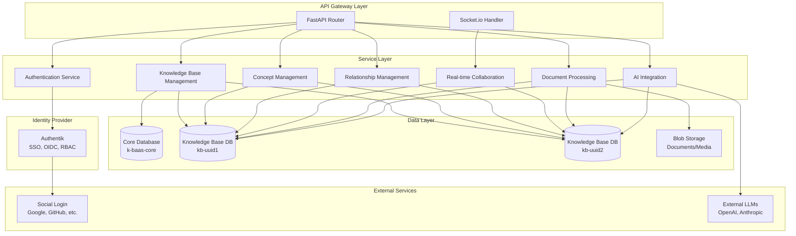

# Components

Based on the multi-database architecture and data models, the system is organized into distinct service components with clear responsibilities and interfaces.

## Authentication Service (Authentik)

**Responsibility:** All authentication, user management, SSO, and RBAC delegated to Authentik identity provider

**Architecture:** Authentik runs as a separate Docker Compose service. The FastAPI backend validates JWT tokens issued by Authentik and extracts user/group claims for authorization. See [Authentik Integration](./authentik-integration.md) for complete details.

**Key Interfaces (Authentik-handled):**
- User registration, login, password recovery via Authentik flows
- Social login (Google, GitHub, Microsoft) via Authentik sources
- Token issuance and refresh via Authentik OAuth2 provider

**FastAPI Integration:**
- GET /auth/me - Current user profile (from validated JWT claims)
- JWT validation via `fastapi-oidc` against Authentik JWKS endpoint
- RBAC via Authentik group claims mapped to application roles

**Dependencies:** Authentik OIDC endpoints, JWKS for token validation

**Technology Stack:** Authentik (IdP), fastapi-oidc for JWT validation, Pydantic for user models

## Knowledge Base Management Service

**Responsibility:** Knowledge base lifecycle management, database creation, and metadata operations

**Key Interfaces:**
- GET /knowledge-bases - List accessible knowledge bases for user
- POST /knowledge-bases - Create new knowledge base (creates new TypeDB database)
- GET /knowledge-bases/{kb_id} - Retrieve knowledge base metadata
- PUT /knowledge-bases/{kb_id} - Update knowledge base settings
- DELETE /knowledge-bases/{kb_id} - Delete knowledge base and associated database
- POST /knowledge-bases/{kb_id}/schema - Apply/update domain schema

**Dependencies:** KnowledgeBase repository (core database), TypeDB database management, schema template service

**Technology Stack:** FastAPI routing, TypeDB admin operations, dynamic database creation, schema deployment utilities

## Concept Management Service

**Responsibility:** CRUD operations for concepts within knowledge bases, wiki content editing, concept linking

**Key Interfaces:**
- GET /kb/{kb_id}/concepts - List concepts with filtering and pagination
- POST /kb/{kb_id}/concepts - Create new concept
- GET /kb/{kb_id}/concepts/{concept_id} - Retrieve concept with full description
- PUT /kb/{kb_id}/concepts/{concept_id} - Update concept fields and description
- DELETE /kb/{kb_id}/concepts/{concept_id} - Delete concept
- POST /kb/{kb_id}/concepts/{concept_id}/links - Extract entity links from description

**Dependencies:** Concept repository (per-KB database), entity extraction utilities, Lexical content processing

**Technology Stack:** TypeDB Python driver for specific KB databases, Pydantic models generated from KB schema, async processing for content analysis

## Relationship Management Service

**Responsibility:** Managing relationships between concepts, bidirectional labeling, relationship suggestions

**Key Interfaces:**
- GET /kb/{kb_id}/relationships - List relationships with filtering
- POST /kb/{kb_id}/relationships - Create new relationship between concepts
- GET /kb/{kb_id}/relationships/{rel_id} - Retrieve relationship details
- PUT /kb/{kb_id}/relationships/{rel_id} - Update relationship properties
- DELETE /kb/{kb_id}/relationships/{rel_id} - Delete relationship
- GET /kb/{kb_id}/concepts/{concept_id}/relationships - Get all relationships for a concept

**Dependencies:** ConceptRelationship repository (per-KB database), Concept validation, bidirectional label management

**Technology Stack:** TypeDB graph queries for relationship traversal, async relationship validation, label formatting utilities

## Real-time Collaboration Service

**Responsibility:** Socket.io connection management, real-time event propagation for concurrent editing, user presence

**Key Interfaces:**
- WebSocket /socket.io - Main Socket.io endpoint for real-time connections
- Event: join_knowledge_base - User joins specific KB session with authentication
- Event: concept_updated - Propagate concept changes to other users
- Event: relationship_updated - Propagate relationship changes
- Event: user_presence - Share user activity and cursor positions
- Event: description_editing - Live editing indicators for concept descriptions

**Dependencies:** Authentication service for connection authorization, Concept/Relationship services for data validation

**Technology Stack:** python-socketio server, async event handling, connection state management, event broadcasting patterns

## Document Processing Service

**Responsibility:** Document upload, parsing, and knowledge extraction from various file formats

**Key Interfaces:**
- POST /kb/{kb_id}/documents/upload - Upload document for processing
- GET /kb/{kb_id}/documents/jobs/{job_id} - Check processing status
- GET /kb/{kb_id}/documents/jobs/{job_id}/results - Retrieve extraction results
- POST /kb/{kb_id}/documents/jobs/{job_id}/approve - Approve extracted concepts and relationships

**Dependencies:** Blob storage for file management, AI Integration service for content analysis, Concept Management service

**Technology Stack:** File processing libraries (PyPDF2, python-docx, markdown), async task processing, temporary file management

## AI Integration Service

**Responsibility:** LLM integration for relationship suggestions, content generation, and concept enhancement

**Key Interfaces:**
- POST /kb/{kb_id}/ai/suggest-relationships - Generate relationship suggestions for concepts
- POST /kb/{kb_id}/ai/generate-descriptions - Create concept descriptions or summaries
- POST /kb/{kb_id}/ai/extract-concepts - Extract concepts from text content
- GET /kb/{kb_id}/ai/suggestions/{suggestion_id} - Retrieve AI suggestion details

**Dependencies:** External LLM APIs (OpenAI, Anthropic), self-hosted LLM endpoints, Concept/Relationship services for context

**Technology Stack:** httpx for async HTTP requests, LLM API client libraries, prompt management, response parsing and validation

## Component Interaction Diagram

