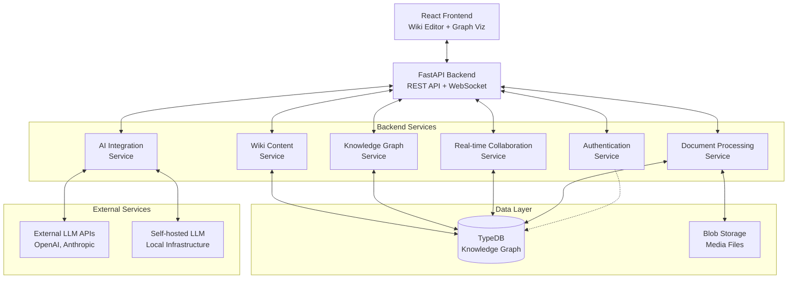

# High Level Architecture

## Technical Summary

K-BAAS-2 employs a modern web application architecture with a clear separation between frontend (React) and backend (FastAPI) components. The system uses TypeDB as the primary knowledge graph database, providing schema-driven entity and relationship storage. The architecture supports real-time collaboration through Socket.io connections and integrates both external and self-hosted LLMs for AI-assisted knowledge creation. Core patterns include RESTful API design, event-driven real-time updates, and a modular service layer that enables independent scaling of different functional areas while maintaining data consistency across wiki content and knowledge graph representations.

## High Level Overview

**Architecture Style**: Modular Monolithic Backend with Service Layers
- The backend follows a modular monolithic approach with clear service layer separation
- Single repository structure containing both frontend and backend applications
- Real-time collaboration layer using Socket.io for concurrent editing capabilities
- Event-driven architecture for synchronizing wiki content with knowledge graph updates

**Repository Structure**: Single Repository (Monorepo without management tools)
- Simplified directory structure with `/frontend` and `/backend` directories
- Shared configuration and deployment scripts at the root level
- Clear separation of concerns without complex monorepo tooling overhead

**Service Architecture**: Layered Service Design
- API Layer: FastAPI endpoints for REST operations
- Service Layer: Business logic and data processing
- Data Layer: TypeDB integration and schema management
- Real-time Layer: Socket.io for collaboration features

**Primary Data Flow**:
1. Users interact with React frontend components
2. Frontend makes REST API calls to FastAPI backend
3. Backend processes requests through service layers
4. TypeDB handles knowledge graph storage and queries
5. Real-time updates propagate via Socket.io to all connected clients
6. AI services integrate for relationship suggestions and content generation

**Key Architectural Decisions**:
- TypeDB as the single source of truth for both wiki content and knowledge graph data
- Unidirectional synchronization from wiki to graph (with todo generation for reverse updates)
- Event-driven real-time collaboration to handle concurrent user interactions
- Schema-first approach using TypeDB schema to generate Pydantic models

## High Level Project Diagram

## Architectural and Design Patterns

- **Event-Driven Architecture:** Real-time collaboration uses event-driven patterns via Socket.io for immediate propagation of changes between users. _Rationale:_ Enables seamless concurrent editing and maintains consistency across multiple user sessions.

- **Repository Pattern:** Data access logic abstracted through repository interfaces for TypeDB operations. _Rationale:_ Enables testing with mock repositories and provides flexibility for future database changes.

- **Service Layer Pattern:** Business logic encapsulated in dedicated service classes with clear interfaces. _Rationale:_ Promotes code reusability, testability, and maintains separation of concerns between API and data layers.

- **Schema-First Design:** TypeDB schema defines data structures that automatically generate Pydantic models. _Rationale:_ Ensures type safety across the application and maintains consistency between database constraints and API validation, with TypeDB as the authoritative source of truth.

- **Command Query Responsibility Segregation (CQRS):** Separate read and write operations for knowledge graph queries vs. updates. _Rationale:_ Optimizes performance for complex graph queries while maintaining consistency for write operations.
