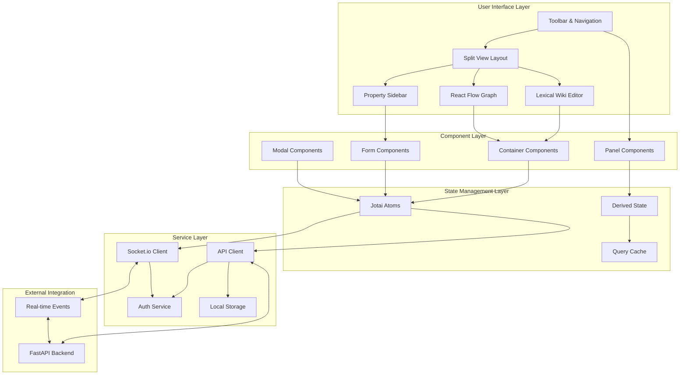

# High Level Frontend Architecture

## Technical Summary

The K-BAAS-2 frontend employs a modern React 19 architecture centered around a flexible split-view interface that seamlessly integrates wiki content editing with interactive knowledge graph visualization. The application uses Jotai for atomic state management, enabling fine-grained reactivity across the wiki editor (Lexical) and graph visualization (React Flow) components. Real-time collaboration is achieved through Socket.io client integration that synchronizes state changes across multiple users. The architecture emphasizes direct manipulation patterns with grid-snapping graph editing, contextual property panels, and bidirectional content synchronization between wiki text and graph entities.

## High Level Overview

**Architecture Style**: Component-Based with Atomic State Management
- React 19 functional components with hooks-based architecture
- Atomic state management using Jotai for granular reactivity
- Event-driven real-time synchronization via Socket.io
- Responsive design optimized for desktop with minimum 1400×900 resolution

**Interface Paradigm**: Split-View Direct Manipulation
- Primary split-view layout: Lexical wiki editor + React Flow graph visualization
- Adjustable split ratios with focus modes for single-view editing
- Direct manipulation graph editing with grid snapping and auto-layout
- Contextual side panels for entity/relationship property editing

**Component Architecture**: Layered Component Design
- Presentation Layer: UI components built on Shadcn/ui and Tailwind
- Container Layer: Smart components managing state and business logic
- Service Layer: API clients and real-time event handlers
- State Layer: Jotai atoms and derived state management

**Primary Data Flow**:
1. User interactions trigger Jotai atom updates
2. State changes propagate to connected React components
3. API calls sync changes with FastAPI backend
4. Socket.io events broadcast real-time updates to other users
5. Received updates merge into local Jotai state
6. UI components reactively update to reflect new state

**Key Architectural Decisions**:
- Jotai atomic state management for fine-grained reactivity and performance
- Unidirectional wiki-to-graph synchronization (matching backend architecture)
- Component composition over inheritance for maximum flexibility
- Real-time optimistic updates with conflict resolution
- Client-side entity extraction from wiki content with backend validation

## High Level Frontend Diagram

## Frontend Architectural Patterns

- **Atomic State Management:** Jotai atoms provide granular state control with automatic dependency tracking and minimal re-renders. _Rationale:_ Enables efficient real-time collaboration and complex state synchronization between wiki and graph views.

- **Component Composition:** React components built through composition rather than inheritance, using render props and compound component patterns. _Rationale:_ Maximizes reusability and flexibility for the diverse UI requirements of split-view editing.

- **Optimistic Updates:** Client-side state updates immediately reflect user actions, with server synchronization and conflict resolution in the background. _Rationale:_ Provides responsive user experience while maintaining data consistency across real-time collaboration.

- **Event-Driven UI:** Component communication through custom events and Jotai atom subscriptions rather than prop drilling. _Rationale:_ Reduces coupling between distant components and simplifies real-time update propagation.

- **Progressive Enhancement:** Core functionality works without JavaScript, with enhanced interactions layered on top. _Rationale:_ Ensures accessibility and provides fallback for users with JavaScript disabled or connectivity issues.
