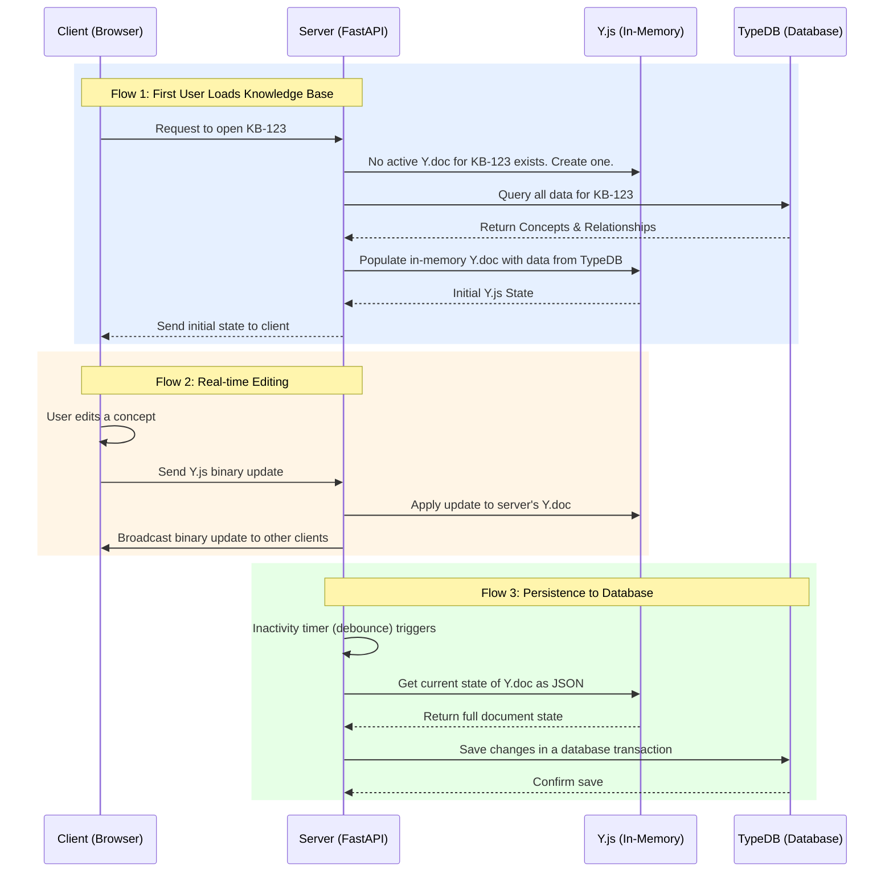

# Real-time Collaboration Integration

Real-time collaboration is powered by a **Conflict-Free Replicated Data Type (CRDT)** approach using the **Y.js** library. This provides a robust, industry-standard solution for concurrent editing, offline support, and automatic conflict resolution.

## Core Architecture

- **Technology:** Y.js as the CRDT engine for managing collaborative data.
- **Backend Role:** The FastAPI/Socket.io backend acts as a simple, efficient broadcast and persistence server for Y.js binary updates. It does not need to understand the content of the updates.
- **Frontend Role:** The frontend state (Jotai) subscribes to the Y.js document, which serves as the single source of truth for all collaborative data during an active session.

## Synchronization Flow: Y.js and TypeDB

**1. First User Loads Knowledge Base:**
- When the first user opens a knowledge base, the server loads the data from TypeDB.
- It creates a new Y.js document in its memory and populates it with the loaded concepts and relationships.
- The client receives this initial state.

**2. Real-time Editing Session:**
- All edits from any client are sent as small, binary Y.js updates to the server.
- The server immediately broadcasts these updates to all other clients in the same session.
- Each client's Y.js instance merges the updates, automatically resolving conflicts and converging to a consistent state.
- **TypeDB is not involved during active editing**, ensuring low latency.

**3. Persistence to TypeDB:**
- The server triggers a save to TypeDB based on specific events:
  - **Debouncing:** After a period of inactivity (e.g., 2-5 seconds).
  - **Last Disconnect:** When the final user leaves the session.
- On trigger, the server converts the current in-memory Y.js document to JSON and saves the changes transactionally to TypeDB.

## Y.js Frontend Integration

**Lexical Editor (`y-lexical`):**
- The official `y-lexical` binding will be used for out-of-the-box collaborative text editing.
- This handles all text synchronization, conflict resolution, and collaborative cursors automatically.

**React Flow Graph (`Y.Map` and `Y.Array`):
- Graph `nodes` and `edges` will be stored in Y.js data structures (e.g., a `Y.Array` of `Y.Map`s).
- UI interactions in React Flow (e.g., dragging a node) will update the corresponding Y.js objects.
- These changes will then be broadcast automatically to other clients.

**Jotai State Binding:**
- We will create a custom Jotai atom that provides a two-way binding between the UI state and the Y.js document.
- When the Y.js document receives a remote update, the Jotai atom will update, triggering a React re-render.
- When the user interacts with the UI, the Jotai atom's write function will update the Y.js document.
