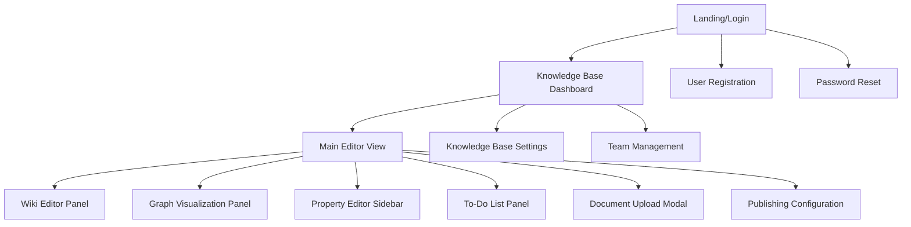
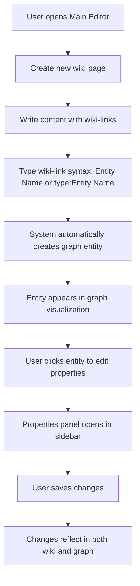
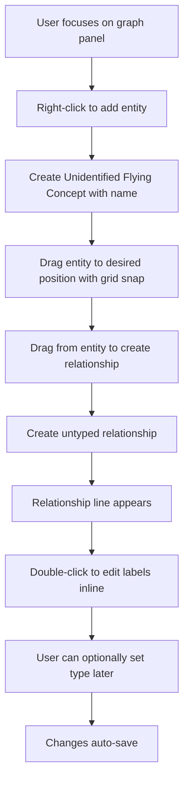
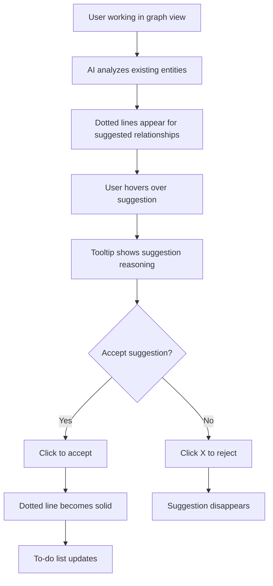
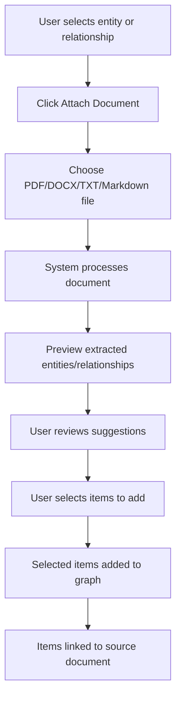

# Knowledge Graph Wiki Tool UI/UX Specification

## Introduction

This document defines the user experience goals, information architecture, user flows, and visual design specifications for the Knowledge Graph Wiki Tool's user interface. The focus is on V0.7 (MVP core features) and V1 (enhanced features) as defined in the PRD.

- **Link to Primary Design Files:** {To be created in Figma - URL will be added}
- **Link to Deployed Storybook / Design System:** {To be created - URL will be added}

## Overall UX Goals & Principles

### Target User Personas
- **Primary:** Domain experts with specialized knowledge but limited technical expertise
- **Secondary:** Collaborative teams of knowledge workers who need to share and build upon complex information structures
- **Tertiary:** Administrators managing knowledge bases and user access

### Usability Goals
- **Intuitive Learning:** Users should be able to start creating knowledge without extensive training
- **Efficient Knowledge Creation:** Streamlined workflows for both wiki editing and graph manipulation
- **Error Prevention:** Clear visual feedback and validation to prevent data loss or structural errors
- **Collaborative Clarity:** Multiple users can work simultaneously without confusion or conflicts

### Design Principles
1. **Clarity Over Complexity:** Simplify complex graph relationships through clear visual hierarchy and progressive disclosure
2. **Bidirectional Consistency:** Wiki and graph views must feel like two perspectives of the same knowledge, not separate tools
3. **Direct Manipulation:** Users should be able to interact directly with visual elements rather than through abstract interfaces
4. **Contextual Guidance:** Provide help and suggestions exactly when and where users need them
5. **Graceful Degradation:** Core functionality works even when advanced features are unavailable

## Information Architecture (IA)

### Site Map / Screen Inventory

### Navigation Structure
- **Primary Navigation:** Top application bar with knowledge base selector, user menu, and core actions
- **Secondary Navigation:** Context-sensitive panels and sidebars within the main editor
- **Tertiary Navigation:** In-panel tabs and contextual menus for specific features

## User Flows

### V0.7 Core User Flow: Create Knowledge with Wiki-to-Graph Sync

**Goal:** User creates a wiki page with entities that automatically appear in the knowledge graph

**Steps:**

### V0.7 Core User Flow: Direct Graph Manipulation

**Goal:** User creates and connects entities directly in the graph view

**Steps:**

### V1 Enhanced User Flow: AI-Assisted Knowledge Creation

**Goal:** User leverages AI suggestions to discover and create relationships

**Steps:**

### V0.7 Core User Flow: Document Upload and Processing

**Goal:** User uploads a document to extract knowledge into the graph

**Steps:**

## Wireframes & Mockups

### Main Editor View (Split-Screen Layout)
- **Left Panel (40-60% width):** Wiki editor with Lexical rich text editor
  - Toolbar with formatting options
  - Auto-complete for wiki-links with type suggestions
  - Live preview of linked entities
- **Right Panel (40-60% width):** Graph visualization with React Flow
  - Zoom/pan controls in bottom-right corner
  - Grid background with snap-to-grid functionality
  - Context menu on right-click
- **Resizable Splitter:** Users can adjust panel proportions
- **Property Sidebar (300px):** Slides in from right when entity/relationship selected
  - Form fields based on schema
  - Document attachment area
  - Comment section (V1)

### Knowledge Base Dashboard
- **Header:** Knowledge base title, team members, settings access
- **Main Content:** Grid of wiki pages with preview cards
- **Sidebar:** Recent activity, to-do items, quick actions
- **Footer:** Publishing status, last sync time

### To-Do List Panel (Overlay/Modal)
- **Filter Controls:** By entity type, completeness level, priority
- **List Items:** Entity/relationship name, missing fields, priority indicator
- **Quick Actions:** Jump to item, mark complete, add to current view

## Component Library / Design System Reference

### V0.7 Core Components
- **WikiEditor:** Lexical-based rich text editor with wiki-link support
- **GraphCanvas:** React Flow wrapper with custom node/edge components
- **PropertyForm:** Dynamic form generator based on schema definitions
- **EntityNode:** Graph node component with type-specific styling (includes "Unidentified Flying Concept" state)
- **RelationshipEdge:** Graph edge component with label and properties (includes untyped state)
- **TodoItem:** List item component for incomplete knowledge elements
- **DocumentUpload:** Drag-and-drop file upload with progress indication

### V1 Enhanced Components
- **SuggestionOverlay:** Dotted line visualization for AI suggestions
- **CollaborationCursor:** Real-time cursor indicators for other users
- **ActivityFeed:** Timeline component for user actions and changes
- **CommentThread:** Threaded discussion component for entities/relationships

## Branding & Style Guide Reference

### Color Palette
- **Primary:** #000000 (Black) - Main text, primary actions
- **Secondary:** #FFFFFF (White) - Backgrounds, secondary text
- **Accent Colors (Pastels):**
  - Entity Types: #FFE5E5 (Light Pink), #E5F3FF (Light Blue), #E5FFE5 (Light Green)
  - Relationships: #FFF5E5 (Light Orange), #F0E5FF (Light Purple)
  - System States: #FFFDE5 (Light Yellow - warnings), #FFE5E5 (Light Red - errors)
- **Feedback Colors:**
  - Success: #4CAF50
  - Warning: #FF9800
  - Error: #F44336
  - Info: #2196F3

### Typography
- **UI Elements:** Inter (sans-serif) - Clean, modern, highly legible
  - Headings: 24px/20px/16px, Weight 600
  - Body: 14px, Weight 400
  - Captions: 12px, Weight 400
- **User Content:** Crimson Text (serif) - Low-contrast, readable serif for wiki content
  - Headings: 28px/24px/20px, Weight 600
  - Body: 16px, Weight 400, Line-height 1.6

### Iconography
- **Icon Set:** Lucide React (consistent, minimal line icons)
- **Usage:** 16px for inline icons, 20px for buttons, 24px for primary actions
- **Style:** 2px stroke width, rounded line caps

### Spacing & Grid
- **Base Unit:** 8px
- **Component Spacing:** 8px, 16px, 24px, 32px
- **Layout Grid:** 12-column grid with 24px gutters
- **Graph Grid:** 20px snap grid for entity positioning

## Accessibility (AX) Requirements

### Target Compliance
- **WCAG 2.1 AA** compliance for all V0.7 and V1 features

### Specific Requirements
- **Keyboard Navigation:**
  - Tab order follows logical flow: wiki editor → graph canvas → property sidebar
  - Graph entities navigable with arrow keys
  - All actions accessible via keyboard shortcuts
- **Screen Reader Support:**
  - Graph structure described through ARIA labels and live regions
  - Entity relationships announced when navigating
  - Form fields properly labeled with descriptions
- **Visual Accessibility:**
  - Minimum 4.5:1 contrast ratio for all text
  - Focus indicators clearly visible (2px solid outline)
  - No reliance on color alone for information
- **Motor Accessibility:**
  - Click targets minimum 44px × 44px
  - Drag operations have keyboard alternatives
  - Timeout warnings for auto-save operations

## Responsiveness

### Breakpoints
- **Mobile:** 320px - 768px (wiki editing only, no graph manipulation)
- **Tablet:** 768px - 1024px (limited graph editing, simplified interface)
- **Desktop:** 1024px+ (full functionality)
- **Large Desktop:** 1400px+ (optimal experience)

### Adaptation Strategy
- **Mobile (V1):** Single-panel view with tab switching between wiki and graph
  - Graph view is read-only with basic zoom/pan
  - Property editing through full-screen modals
- **Tablet:** Stacked layout with collapsible panels
  - Graph editing with touch gestures
  - Simplified property sidebar
- **Desktop:** Full split-screen layout as designed
  - All features available
  - Optimal panel proportions

## V0.7 Specific UI Specifications

### Wiki Editor Panel
- **Toolbar:** Sticky header with formatting controls (Bold, Italic, Headings, Lists, Links)
- **Content Area:** Minimum 400px width, full height with scroll
- **Wiki-Link Autocomplete:** Dropdown appears below cursor with entity suggestions
- **Entity Indicators:** Subtle background highlight for linked entities with type color

### Graph Visualization Panel
- **Canvas:** Full panel size with zoom range 0.1x to 3x
- **Grid:** 20px squares, subtle gray lines (#F5F5F5)
- **Entities:** Rounded rectangles, 120px min width
  - **Unidentified Flying Concepts:** Dashed border (#999999) with neutral background (#F8F8F8)
  - **Typed Entities:** Solid border with type-specific pastel background colors
- **Relationships:** Curved lines with arrow heads, labels at midpoint
  - **Untyped Relationships:** Dashed lines (#999999) with "?" label
  - **Typed Relationships:** Solid lines with relationship type labels
- **Selection:** 2px blue outline (#2196F3) with resize handles

### Property Editor Sidebar
- **Width:** 320px, slides in from right
- **Header:** Entity/relationship name with type badge
- **Form Fields:** Stacked with 16px spacing, full-width inputs
- **Actions:** Save/Cancel buttons at bottom, auto-save indicator

## V1 Specific UI Enhancements

### AI Suggestion Visualization
- **Suggested Relationships:** Dotted lines (#999999, 2px dash pattern)
- **Hover State:** Solid line preview with confidence indicator
- **Accept/Reject Controls:** Small circular buttons at line midpoint
- **Reasoning Tooltip:** Appears on hover with AI explanation

### Real-time Collaboration Indicators
- **User Cursors:** Colored indicators with user initials
- **Active Selections:** Colored outlines matching user colors
- **Presence Indicators:** Small avatars in top-right corner
- **Activity Notifications:** Toast messages for important changes

### Enhanced To-Do Management
- **Priority Indicators:** Color-coded dots (Red: High, Yellow: Medium, Green: Low)
- **Filtering Controls:** Dropdown menus and search input
- **Quick Actions:** Hover reveals "Jump to" and "Mark Complete" buttons
- **Progress Tracking:** Completion percentage for knowledge base

## Change Log

| Change                      | Date       | Version | Description                                               | Author                     |
| --------------------------- | ---------- | ------- | --------------------------------------------------------- | -------------------------- |
| Initial UI/UX Specification | 06/12/2025 | 0.1     | Created comprehensive UI/UX spec for V0.7 and V1 features | Desiree (Design Architect) |