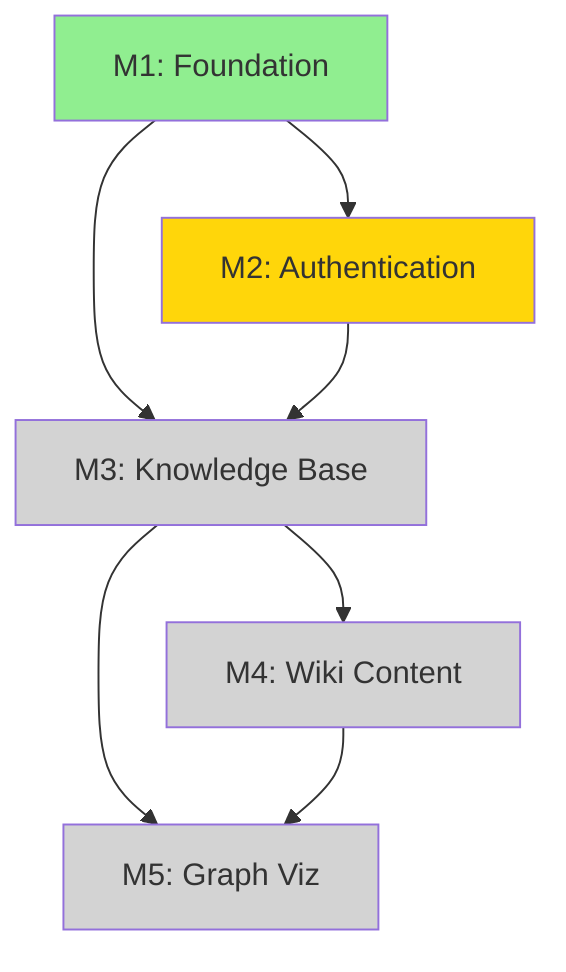
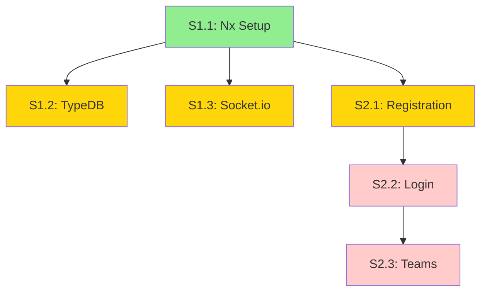
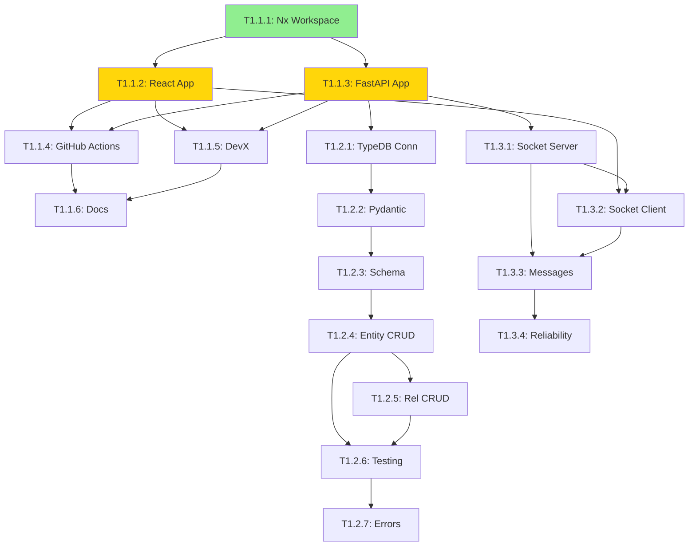
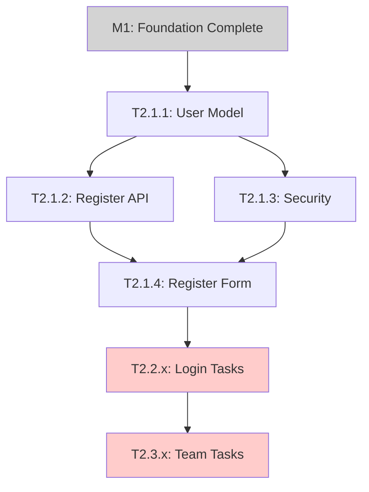

# 🔗 Dependencies View - Project Management

**View Type:** Network/Dependency Layout  
**Filter:** All issues with dependency relationships  
**Audience:** Project Manager, Technical Lead

## 🎯 View Configuration

### Dependency Types
- **Blocks** - Issue prevents other issues from starting
- **Blocked by** - Issue cannot start until dependencies complete
- **Related to** - Issues that share context or affect each other

### Visualization
- **Layout:** Dependency graph with clear blocking relationships
- **Colors:** Red (blocked), Yellow (blocking), Green (ready)
- **Grouping:** By Epic and Story for hierarchy

## 📊 Complete Dependency Map (GitHub Mirror)

### Epic Level Dependencies


### Story Level Dependencies


### Task Level Dependencies (Critical Path)

#### Foundation Task Chain


#### Authentication Task Chain


## 🚨 Dependency Issues & Bottlenecks

### Critical Bottlenecks

#### 1. T1.1.1: Nx Workspace Setup
```
Blocking Impact: ALL other tasks (20 tasks blocked)
Team Impact: ALL 3 developers cannot start real work
Duration: 2 days
Risk Level: CRITICAL
Mitigation: All hands on deck, highest priority
```

#### 2. T1.1.3: FastAPI Backend Setup
```
Blocking Impact: TypeDB (7 tasks) + Socket.io (4 tasks) = 11 tasks
Team Impact: Developer 1 backend work pipeline
Duration: 2 days  
Risk Level: HIGH
Mitigation: Developer 1 priority, cross-training backup
```

#### 3. M1: Foundation Milestone
```
Blocking Impact: ALL Epic 2 work (7+ tasks)
Team Impact: Authentication features cannot start
Duration: ~40 days (4 months)
Risk Level: MEDIUM (long-term)
Mitigation: Ensure M1 quality, plan M2 in advance
```

### Dependency Violations

#### Missing Task Dependencies
```
❌ S2.2 & S2.3: Stories exist but no tasks
→ Impact: Cannot estimate Epic 2 completion
→ Fix: Create T2.2.x and T2.3.x tasks

❌ Epic-level issues missing
→ Impact: No parent-child relationship visibility
→ Fix: Create Epic container issues
```

#### Circular Dependencies
```
✅ None detected
→ All dependencies follow logical progression
→ Foundation → Authentication → Features
```

## 📈 Dependency Analysis

### Parallel Work Opportunities

#### Phase 1: After T1.1.1 Complete
```
Parallel Tracks:
├── Developer 1: T1.1.3 (FastAPI backend)
├── Developer 2: T1.1.2 (React frontend)  
└── Developer 3: Planning/preparation

Duration: 2 days
Risk: Low (independent work)
```

#### Phase 2: After Apps Complete
```
Parallel Tracks:
├── Developer 1: T1.2.1 (TypeDB connection)
├── Developer 2: T1.1.6 (Documentation)
├── Developer 3: T1.1.4 (CI/CD) + T1.3.1 (Socket.io)

Duration: 2-3 days
Risk: Medium (coordination needed)
```

#### Phase 3: Database vs Real-time
```
Parallel Tracks:
├── Developer 1: T1.2.x series (TypeDB)
└── Developer 3: T1.3.x series (Socket.io)

Dependencies: Both need FastAPI backend ready
Duration: 5-8 days
Risk: Medium (shared backend resources)
```

### Sequential Dependencies

#### TypeDB Task Chain (Developer 1)
```
T1.2.1 → T1.2.2 → T1.2.3 → T1.2.4 → T1.2.5 → T1.2.6 → T1.2.7
Duration: 18 days total (sequential)
Optimization: T1.2.4 and T1.2.5 could partially overlap
```

#### Socket.io Task Chain (Developer 3)
```
T1.3.1 → T1.3.2 → T1.3.3 → T1.3.4
Duration: 5 days total (mostly sequential)
Optimization: T1.3.2 could start before T1.3.1 complete
```

## 🎯 Dependency Management Strategy

### Immediate Actions
1. **Prioritize T1.1.1** - All developers focus until complete
2. **Prepare next tasks** - Pre-assign T1.1.2 and T1.1.3
3. **Create missing tasks** - Fill S2.2 and S2.3 task gaps
4. **Plan parallel work** - Optimize developer allocation

### Risk Mitigation
1. **Cross-training** - Each developer shadows critical path tasks
2. **Early planning** - Define S2.2/S2.3 tasks while M1 in progress
3. **Resource buffer** - Account for dependency delays in estimates
4. **Communication** - Daily standups focused on blockers

### Dependency Tracking Tools

#### GitHub Features to Use
- **Issue linking** - "Blocks #X" and "Blocked by #Y" comments
- **Project automation** - Auto-move issues based on dependencies
- **Milestone dependencies** - Epic-level blocking relationships
- **Status labels** - "status:blocked" for clear visibility

#### Process Improvements
- **Dependency review** - Weekly check of all blocking relationships
- **Blocker escalation** - Fast-track resolution of critical blockers
- **Parallel planning** - Always have 2-3 ready tasks per developer
- **Definition of Ready** - No task starts without dependencies resolved

## 📊 Dependency Metrics

### Current Blocking State
- **Total Tasks:** 21
- **Blocked Tasks:** 21 (100%)
- **Ready Tasks:** 1 (T1.1.1 only)
- **Bottleneck Tasks:** 3 (T1.1.1, T1.1.3, M1)

### Dependency Depth
- **Longest Chain:** 7 tasks (T1.1.1 → ... → T1.2.7)
- **Average Chain:** 3.2 tasks
- **Parallelization Potential:** 60% of tasks could run parallel

### Resolution Impact
- **T1.1.1 completion:** Unblocks 6 immediate tasks
- **T1.1.3 completion:** Unblocks 11 additional tasks  
- **M1 completion:** Unblocks all Epic 2 work

## ✅ Success Criteria

### Short-term (1-2 weeks)
- [ ] T1.1.1 completed, dependency chain started
- [ ] 3+ tasks running in parallel
- [ ] Zero circular dependencies
- [ ] All immediate blockers identified

### Medium-term (1-2 months) 
- [ ] M1 foundation providing stable platform
- [ ] Epic 2 tasks fully defined and ready
- [ ] Dependency chains optimized for parallel work
- [ ] Team velocity stable and predictable

### Long-term (3-6 months)
- [ ] All planned epics have clear dependency paths
- [ ] Cross-epic dependencies well understood
- [ ] Team can work independently on separate tracks
- [ ] Dependency bottlenecks eliminated through architecture 