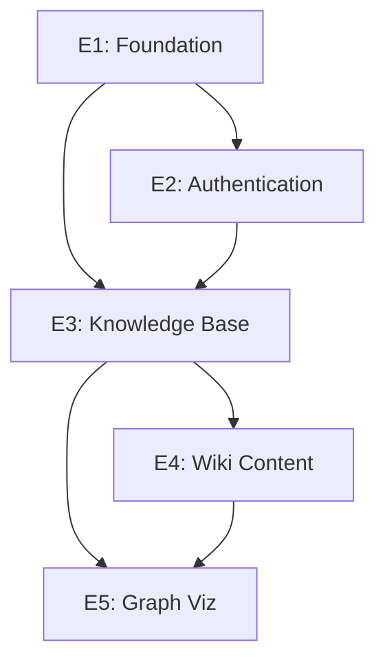

# 📊 Epic Overview - Project View

**View Type:** Board Layout  
**Filter:** Epic-level issues + Epic breakdown  
**Audience:** Product Owner, Project Manager

## 🎯 View Configuration

### Columns
- **Epic Backlog** - Planned epics not yet started
- **Epic Active** - Currently active epics  
- **Epic Done** - Completed epics

### Grouping
- **Group by:** Epic Label (`epic:E1-foundation`, `epic:E2-authentication`, etc.)
- **Sort by:** Priority, then Timeline

### Filters
- **Include:** All issues with epic labels
- **Milestone:** All milestones (M1-M5)
- **Status:** Open issues

## 📋 Current State (Mirror van GitHub)

### Epic Active (2)
```
🏗️ E1: Foundation & Infrastructure
├── Status: In Progress
├── Issues: 20 (17 tasks, 3 stories)
├── Progress: ~30% estimated
├── Timeline: Sep 2025
└── Blocking: E2, E3, E4, E5

🔐 E2: Authentication & User Management  
├── Status: Ready for Development
├── Issues: 7 (4 tasks complete, 3 missing)
├── Progress: ~60% planned
├── Timeline: Dec 2025
└── Blocked by: E1
```

### Epic Backlog (3)
```
📚 E3: Knowledge Base Core
├── Status: Not Started
├── Issues: 0 (need to create)
├── Progress: 0%
├── Timeline: Mar 2026
└── Blocked by: E1, E2

📝 E4: Basic Wiki
├── Status: Not Started  
├── Issues: 0 (need to create)
├── Progress: 0%
├── Timeline: Jun 2026
└── Blocked by: E1, E2, E3

🕸️ E5: Basic Graph
├── Status: Not Started
├── Issues: 0 (need to create)
├── Progress: 0%
├── Timeline: Sep 2026
└── Blocked by: E1, E2, E3, E4
```

### Epic Done (0)
*Geen voltooide epics*

## 📊 Epic Progress Metrics

### E1: Foundation & Infrastructure
- **Completion:** 0/20 issues closed
- **In Progress:** 0 issues actively worked on
- **Ready:** All 20 issues ready for pickup
- **Blocked:** 0 issues blocked
- **Effort Remaining:** ~40 days estimated

### E2: Authentication & User Management  
- **Completion:** 0/7 issues closed
- **Planned:** 4/7 issues have full task breakdown
- **Missing:** 3 issues need task creation (S2.2, S2.3)
- **Effort Remaining:** ~12 days estimated (partial)

### E3-E5: Future Epics
- **Planning Status:** Milestones exist, no issues created
- **Content Gap:** 100% missing from GitHub
- **Local Planning:** Full epic definitions exist locally
- **Action Needed:** Bulk content transfer

## 🚨 Epic-Level Issues

### Missing Epic Issues
**Problem:** No `type:epic` issues exist as parent containers
**Impact:** Stories appear disconnected from epic context
**Solution:** Create Epic-level issues for proper hierarchy

### Content Volume Gap
**Problem:** Epic 3-5 have 0 issues but extensive local planning exists
**Impact:** Team cannot see full project scope
**Solution:** Transfer local content to GitHub issues

### Progress Tracking
**Problem:** No epic-level progress indicators
**Impact:** Difficult to track epic completion status
**Solution:** Implement epic progress automation

## 🎯 Epic Dependencies



## 📈 Epic Timeline

| Epic | Start | End | Duration | Dependencies |
|------|-------|-----|----------|--------------|
| **E1** | Now | Sep 2025 | 4 months | None |
| **E2** | Sep 2025 | Dec 2025 | 3 months | E1 |
| **E3** | Dec 2025 | Mar 2026 | 3 months | E1, E2 |
| **E4** | Mar 2026 | Jun 2026 | 3 months | E1, E2, E3 |
| **E5** | Jun 2026 | Sep 2026 | 3 months | E1, E2, E3, E4 |

## ✅ View Actions

### For Product Owner
- **Monitor epic progress** via completion percentages
- **Adjust scope** based on epic velocity
- **Communicate timeline** to stakeholders
- **Prioritize epic dependencies**

### For Project Manager
- **Track epic dependencies** and resolve blockers
- **Monitor resource allocation** across epics
- **Plan epic-level sprints** and releases
- **Report epic status** to leadership 