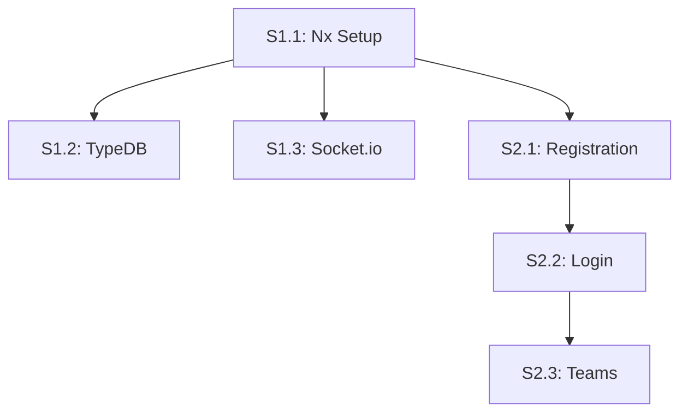

# 📋 Story Progress - Project View

**View Type:** Board Layout  
**Filter:** Story-level issues (`type:story`)  
**Audience:** Scrum Master, Development Team

## 🎯 View Configuration

### Columns
- **Story Ready** - Stories with complete task breakdown
- **Story Planning** - Stories being broken down into tasks
- **Story In Progress** - Stories with active development  
- **Story Review** - Stories awaiting final review
- **Story Done** - Completed stories

### Grouping
- **Group by:** Epic (`epic:E1-foundation`, `epic:E2-authentication`)
- **Sort by:** Priority, Dependencies

### Filters
- **Type:** `type:story` only
- **Status:** Open issues
- **Version:** `version:v0.7`

## 📋 Current State (Mirror van GitHub)

### Story Ready (3)
```
✅ S1.1: Nx Monorepo Setup (E1)
├── Epic: Foundation & Infrastructure
├── Tasks: 6/6 defined (T1.1.1-T1.1.6)
├── Effort: 5 days total
├── Team: All developers
├── Dependencies: None (foundational)
└── Status: Complete task breakdown

✅ S1.2: TypeDB Integration (E1)
├── Epic: Foundation & Infrastructure  
├── Tasks: 7/7 defined (T1.2.1-T1.2.7)
├── Effort: 8 days total
├── Team: Developer 1 + 3
├── Dependencies: Blocked by S1.1
└── Status: Complete task breakdown

✅ S1.3: Socket.io Realtime (E1)
├── Epic: Foundation & Infrastructure
├── Tasks: 4/4 defined (T1.3.1-T1.3.4)
├── Effort: 3 days total
├── Team: Developer 3 + 1
├── Dependencies: Blocked by S1.1
└── Status: Complete task breakdown
```

### Story Planning (3)
```
⚠️ S2.1: User Registration (E2)
├── Epic: Authentication & User Management
├── Tasks: 4/4 defined (T2.1.1-T2.1.4)
├── Effort: 4 days total
├── Team: Developer 1 + 2
├── Dependencies: Blocked by M1
└── Status: Complete task breakdown

⚠️ S2.2: User Login JWT (E2)
├── Epic: Authentication & User Management
├── Tasks: 0/? defined (MISSING)
├── Effort: TBD
├── Team: Unassigned
├── Dependencies: Blocked by S2.1
└── Status: NEEDS TASK BREAKDOWN

⚠️ S2.3: Team Management (E2)
├── Epic: Authentication & User Management
├── Tasks: 0/? defined (MISSING)
├── Effort: TBD
├── Team: Unassigned  
├── Dependencies: Blocked by S2.2
└── Status: NEEDS TASK BREAKDOWN
```

### Story In Progress (0)
*Geen stories in actieve development*

### Story Review (0)
*Geen stories in review*

### Story Done (0)
*Geen voltooide stories*

## 📊 Story Analysis

### Epic 1: Foundation & Infrastructure ✅
- **Stories:** 3/3 completely planned
- **Tasks:** 17/17 tasks defined
- **Effort:** 16 days total estimated
- **Status:** Ready for development
- **Dependencies:** Clear and logical

### Epic 2: Authentication & User Management ⚠️
- **Stories:** 3 stories, 1 complete, 2 incomplete
- **Tasks:** 4/12+ tasks defined (33% completion)
- **Missing Tasks:**
  - S2.2 needs 4+ tasks (JWT, login, tokens)
  - S2.3 needs 4+ tasks (teams, invites, management)
- **Status:** Partially ready

## 🚨 Story-Level Issues

### Incomplete Task Breakdown
**Stories Affected:** S2.2, S2.3
**Problem:** Story exists but no tasks defined
**Impact:** Cannot estimate effort or assign work
**Solution:** Create missing T2.2.x and T2.3.x tasks

### Suggested Missing Tasks

#### S2.2: User Login & JWT Authentication
```
T2.2.1: JWT Token Service Implementation
T2.2.2: Login API Endpoint  
T2.2.3: Frontend Login Component
T2.2.4: Token Refresh Mechanism
```

#### S2.3: Team Creation & Management
```
T2.3.1: Team Model & Database Schema
T2.3.2: Team Management API
T2.3.3: Team Creation UI
T2.3.4: Team Member Invitation System
```

## 📈 Story Progress Metrics

### Story Completion Rate
- **Epic 1:** 100% task breakdown complete
- **Epic 2:** 33% task breakdown complete
- **Overall:** 67% of stories ready for development

### Effort Distribution
- **S1.1 (Nx Setup):** 5 days, 6 tasks
- **S1.2 (TypeDB):** 8 days, 7 tasks  
- **S1.3 (Socket.io):** 3 days, 4 tasks
- **S2.1 (Registration):** 4 days, 4 tasks
- **S2.2 (Login):** TBD, 0 tasks
- **S2.3 (Teams):** TBD, 0 tasks

### Team Assignment
- **Developer 1:** S1.2 (lead), S1.3 (support), S2.1 (backend)
- **Developer 2:** S1.1 (involved), S2.1 (frontend)  
- **Developer 3:** S1.3 (lead), S1.2 (support)
- **Unassigned:** S2.2, S2.3

## 🔗 Story Dependencies



## ✅ Next Actions for Story Readiness

### Immediate (This Week)
1. **Create T2.2.x tasks** for S2.2 User Login
2. **Create T2.3.x tasks** for S2.3 Team Management
3. **Assign teams** to S2.2 and S2.3
4. **Estimate effort** for missing tasks

### Sprint Planning
1. **Start with S1.1** (foundational, no dependencies)
2. **Parallel S1.2 + S1.3** after S1.1 complete
3. **Begin S2.1** once foundation ready
4. **Sequential S2.2 → S2.3** for authentication flow

## 📋 Story Acceptance Criteria Status

### Ready for Development
- ✅ **S1.1:** Complete acceptance criteria
- ✅ **S1.2:** Complete acceptance criteria  
- ✅ **S1.3:** Complete acceptance criteria
- ✅ **S2.1:** Complete acceptance criteria

### Needs Definition
- ❌ **S2.2:** Missing acceptance criteria
- ❌ **S2.3:** Missing acceptance criteria 